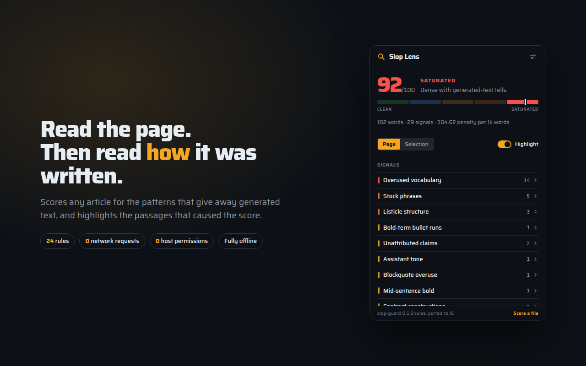
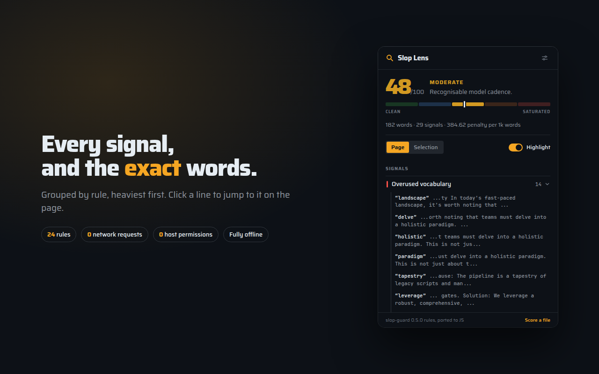
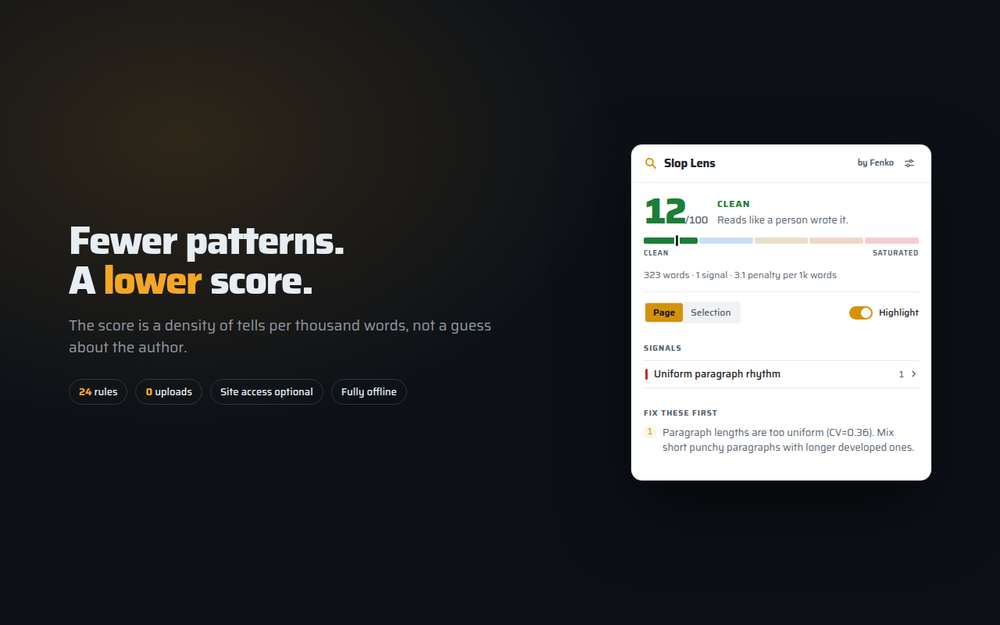
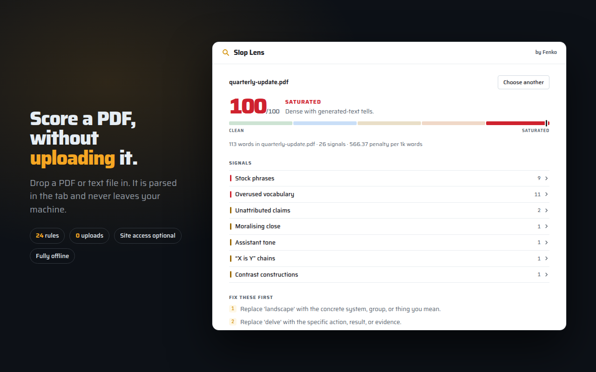
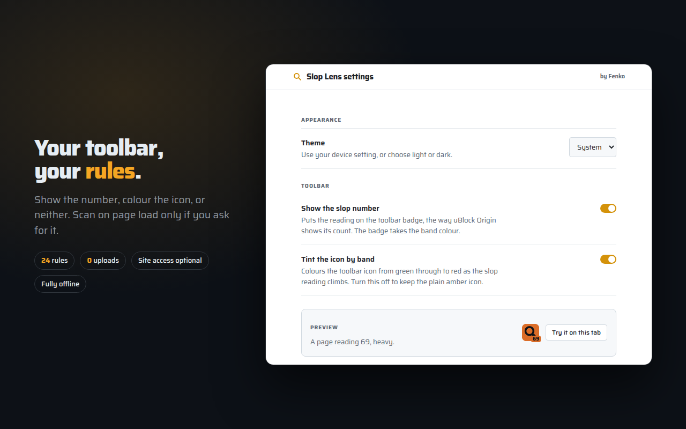

# Slop Lens

A [free Fenko tool](https://fenko.nz/slop-lens/) that scores writing patterns
and highlights the passages behind the score. It does not establish AI
authorship or provenance.

Scoring runs entirely in your browser, with no uploads or telemetry.
Auto-scan is optional and asks for site access. See [Privacy](PRIVACY.md) for
permissions, local storage and external links.


| | |
| --- | --- |
|  |  |
|  |  |
|  | |

## What it actually does

It is a JavaScript port of [slop-guard](https://github.com/eric-tramel/slop-guard)
0.5.0 by Eric W. Tramel (MIT), which is the engine behind
[slopscanner.com](https://slopscanner.com). No model, no API, just about 100
compiled patterns plus a handful of statistical checks:

| Family | Examples |
| --- | --- |
| Vocabulary | `delve`, `tapestry`, `robust`, `seamless`, `paradigm` (~80 words) |
| Stock phrases | "it's worth noting", "at the end of the day", "let's dive in" (~95) |
| Assistant voice | "would you like", "as an AI", "Certainly," |
| Rhetorical tics | "X, not Y", "This isn't X. It's Y.", "Simple, but powerful." |
| Structure | bold-header blocks, long bullet runs, triadic lists, blockquote and divider overuse |
| Statistics | sentence-length variance, paragraph-length variance, em-dash density, elaboration-colon density, copula chains, repeated n-grams |

Scoring is exponential decay on penalty density, so tells matter relative to
length:

```
density = weighted_penalties / (words / 1000)
score   = 100 * exp(-0.04 * density)
slop    = 100 - score                     # what the UI shows
```

Repeating one rhetorical tic costs far more than using several different ones
once. `contrast_pairs`, `pithy_fragment` and `setup_resolution` are amplified
by 2.5x per extra occurrence.

**slop-guard scores cleanliness; Slop Lens reports slop.** The engine's number
runs 100-is-clean, which is backwards for a tool called a slop lens, so it is
inverted exactly once at the display layer. Everything you see (the number,
the rail, the badge) counts slop upward, and a page slop-guard scores 8 is
shown as 92. Hover the number for the original score if you want to compare
against slopscanner.com. Nothing in `src/engine/` is touched by this; it still
matches the reference byte for byte.

Bands, in slop: 0–20 clean · 21–40 light · 41–60 moderate · 61–80 heavy ·
81–100 saturated.

## Install

Free and open source, MIT.

[Chrome Web Store](https://chromewebstore.google.com/detail/slop-lens/mcnjjendjmakiioflhhjijdnffiejiih) ·
[GitHub releases](https://github.com/FenkoHQ/slop-lens/releases)

### Manual installation

Download `slop-lens-<version>.zip` from the latest release and unzip it.

**Chrome / Chromium / Edge**: `chrome://extensions` → enable Developer mode →
*Load unpacked* → pick the unzipped folder.

**Firefox**: `about:debugging#/runtime/this-firefox` → *Load Temporary Add-on*
→ pick `manifest.json` in the unzipped folder. The build is unsigned, so
release Firefox removes it on restart. Developer Edition, Nightly and ESR keep
it if `xpinstall.signatures.required` is `false` in `about:config`.

Manual installations do not update themselves. Repeat with the new ZIP to upgrade.

Check a download against `SHA256SUMS` in the same release. `package.py` is
reproducible, so the zip hash also matches a local build of the tagged commit.

## Use

Settings offer System, Light and Dark themes, shared across the popup, file
scorer and settings page. The preference stays on this device.

Click the toolbar icon. It reads the article, scores it, and paints the
matches on the page.

**If you have text selected, that is what gets scored.** Selecting a passage
is already a statement about what you care about, so the popup opens on it
instead of the whole article. Below ten words a selection is treated as a
stray drag and ignored. That is the same floor the analyzer itself uses.

- **Page / Selection** switches what is scored; clicking the active one
  rescans. Selection is greyed out when nothing is selected.
- **Signals** groups the hits by rule, heaviest penalty first. Click a hit to
  scroll to it and highlight it in orange.
- **Highlight** toggles the overlay. The overlay is a `pointer-events: none`
  layer appended to `<body>`; nothing in the page's own DOM is modified.
  Selection scores are text-only, so they are not highlighted.

Browser-internal pages (`chrome://`, `about:`, the add-on stores) cannot be
scanned, because extensions are not allowed to run there.

### PDFs: hand it the file

Opening a PDF gives a tab whose DOM is four elements and no text at all. The
document is rendered inside the browser's own PDF viewer, in a frame
extensions cannot reach, so scanning the tab can never work and selecting text
there does not help either.

So the file goes in directly. **Score a file** in the popup footer opens a
page where you drop a PDF, or pick one. It is parsed by a bundled copy of
pdf.js in that tab, scored, and forgotten. Nothing is uploaded, and no
permission beyond the ones already granted is needed, because a file you hand
over is not a file the extension went looking for.

Plain text and Markdown files work there too.

A PDF has no paragraphs, only glyphs at coordinates, so `src/readfile.js`
rebuilds the line and paragraph structure from text-item geometry: a vertical
jump past 0.3 of the glyph height is a line break, past 1.6 is a paragraph.
Without that the document collapses into one line and the structural rules go
blind, the same failure the pre-wrap handling fixes for social posts.

Two limits worth knowing. A scanned PDF is images, not text, and reports that
plainly rather than scoring an empty string. CJK documents may extract poorly,
because the pdf.js character maps are not bundled; they would add more weight
than the rest of the extension combined.

### The toolbar reading

After a scan the tab's toolbar icon takes the band colour and the badge shows
the slop reading, so you can read the rating without reopening the popup:

| Band | Slop | Colour | |
| --- | --- | --- | --- |
| Clean | 0–20 | `#3FB950` | Reads like a person wrote it |
| Light | 21–40 | `#58A6FF` | A few tells, nothing damning |
| Moderate | 41–60 | `#D29922` | Recognisable model cadence |
| Heavy | 61–80 | `#DB6D28` | Heavy formulaic patterning |
| Saturated | 81–100 | `#F85149` | Dense with generated-text tells |

Those are Fenko's threat-severity colours, so the scale reads the same way as
every other Fenko surface.

By default the badge is per tab and appears only after you scan that tab. That
is the cost of holding `activeTab` instead of a standing permission on every
site: the extension cannot look at a page until you ask it to. A selection
scan never changes the toolbar reading, since it says nothing about the page.

### Scanning on page load

**Scan pages automatically**, in settings, scores every page as it finishes
loading, so the toolbar is already coloured before you click.

Installing opens the settings page with a prompt to turn it on. **Turn on**
asks for permission to read the pages you visit, because a page cannot be
scanned before you have asked for it otherwise. **Not now** leaves the
extension click-to-scan, and the switch in settings turns it on or off later. The permission is declared as `optional_host_permissions`, so a
fresh install holds nothing extra, and turning the switch back off hands it
back. Nothing is transmitted either way: there is still no network code.

An automatic scan never paints highlights and never uses your selection; it
scores the page and writes the toolbar reading, nothing else.

#### Waiting for the article

A client-rendered page reaches the load event with an empty shell, so scanning
on that event alone finds nothing and the toolbar stays blank until you click.
Measured on one such article: `complete` fired, the scan found no text, and a
manual scan seconds later found 3211 words.

So the scan does not give up on the load event. The retry loop lives in the
page, not in the worker, because a service worker is torn down after a few
seconds idle while the page script lives as long as the page does. It rescans
every few seconds, waking early on DOM changes, for up to ninety seconds, and
reports the result back by message.

Both `onUpdated` signals are acted on. Chrome commits the URL before the page
has loaded anything, so a watch started there spends its budget on the load
itself; the later `complete` restarts the watch with a fresh budget rather than
being skipped as a duplicate. A bare URL change also covers a single-page app
moving between articles without a load event.

**The number is cleared before every scan.** A stale reading describes the
previous page, and while the new one is unknown no number is better than the
wrong one. If a page never yields an article, or has less prose than the
analyzer's ten-word floor, the toolbar stays blank rather than reporting a
"clean" that was never measured.

Both halves are optional, and independent. The settings page, reachable from
the icon in the popup header, turns off the number, the colour, or both:

- **Show the slop number** puts the reading on the badge, the way uBlock
  Origin shows its count.
- **Tint the icon by band** colours the icon from green through to red.

Turn both off and the toolbar stays plain amber; the reading is then only in
the popup.

Flipping a switch rewrites every open tab straight away rather than waiting
for the next scan. Tabs scanned earlier in the session get the new treatment
using their remembered reading; the rest are cleared. **Try it on this tab**
puts a sample reading on the toolbar so the effect is visible without scanning
anything first.

Settings live in `storage.local`, never `storage.sync`, because sync would
ship them through the browser account and nothing here is allowed to leave the
machine. The per-tab readings that make the instant rewrite possible live in
`storage.session`, which is held in memory and never written to disk, so
closing the browser leaves no trace of what was scanned.

If the toolbar looks unchanged, check the extension is pinned: an unpinned
extension lives inside the puzzle-piece menu, where its badge is not visible.
The settings page reports it outright if the browser refuses a toolbar write.

`chrome.action.setIcon` resolves a relative path against the calling page, so
`icons/icon-16.png` asked for from `src/popup.html` becomes
`src/icons/icon-16.png` and the call rejects. Icon paths go through
`runtime.getURL`, and the icon and badge are written independently so a
failure in one cannot take the other down with it.

## How the page becomes analyzable text

Half of slop-guard's rules are about Markdown structure: bold headers, bullet
runs, blockquotes, fenced code. Feeding it `innerText` would throw all of that
away, so `src/extract.js` picks the article container, skips navigation,
asides, footers and common page furniture, and serializes what is left back to
Markdown.

Picking the container tries semantic markup first: schema.org `articleBody`,
`.mw-parser-output`, `<article>`, `<main>`. Plenty of real sites have none of
those and wrap every paragraph in its own styled div, so the fallback credits
every substantial paragraph to its ancestors, with the credit decaying as it
climbs, and takes the best-scoring ancestor that is not mostly links. On one
such article, looking only at direct `<p>` children captured 154 words of
1494; crediting ancestors captures 1354, and the verdict moved from 73 to 19,
which is the difference between scoring a fragment and scoring the page.

While serializing it records every run of non-whitespace text against its
source DOM node. That map is what turns a violation's character offsets back
into a `Range`, which is how the highlights land on the right words.

### Social posts and `white-space: pre-wrap`

LinkedIn, X and most in-app composers render an entire multi-line post as a
**single text node** with no `<br>` and no block children. The line breaks
are literal `\n` characters kept alive by `white-space: pre-wrap`. One
LinkedIn post measured here was 2994 characters with 70 newlines in one node.

Collapsing that the way you collapse source indentation flattens the post into
one paragraph, and every structural rule (bullet density, bullet runs,
paragraph rhythm, blockquotes) goes blind. The extractor checks the computed
`white-space` of a text node's parent and, where it preserves newlines, keeps
them: a single newline becomes a line break, two or more become a paragraph
break. Runs of spaces are still collapsed, since they change nothing the
analyzer measures.

### Known artifact

Pages that bold terms mid-sentence as a house convention, such as Wikipedia
bolding the article title in its lead sentence, trip the
`intrasentence_keyword_bold` rule. That is faithful to what slop-guard does
with the equivalent Markdown; it is not a conversion bug. Read that signal
with the source's conventions in mind.

## Design

Fenko design system: `#F5A623` amber accent, the GitHub-derived neutral
ramp, 4px spacing grid, 8px card / 4px control radii, 150ms transitions. Light
and dark follow the device by default, with a local theme override in settings.

Typeface is **Saira**, bundled as a variable `woff2` so it covers 100–900 from
two files and needs no network. Regenerate the icon set with
`python3 tools/make-icons.py`. The same script produces the neutral icon and
all five band variants.

The readout is a rail, not a progress bar: five band segments with the live
one lit and a marker on it. It shows where the page sits on the whole scale
rather than just how full a bar is, which is the one thing a number alone
cannot tell you.

The rail runs **clean on the left, saturated on the right**: more of the thing
being measured means further right, the way every severity scale reads. The
number, the marker and the badge all move together on that axis because they
all report slop rather than slop-guard's inverted score. See the note under
the scoring formula above.

## Layout

```
manifest.json          MV3, permissions: activeTab + scripting only
src/engine/            slop-guard 0.5.0 port (no DOM dependency)
  util.js              Python-compatible rounding, Unicode \w, whitespace split
  markdown.js          fenced/inline code spans and derived text views
  document.js          cached line/sentence/token projections
  ngrams.js            repeated-phrase detection
  scoring.js           penalties -> density -> score, violation span resolution
  rules.js             the 24 rules and the default pipeline
  engine.js            analyzeText()
src/extract.js         DOM -> Markdown + offset map
src/content.js         injected scanner and highlight overlay
src/report.js          builds the report DOM, shared by all surfaces
src/settings.js        stored preferences and per-tab readings
src/indicator.js       toolbar icon and badge, shared by popup and settings
src/options.*          the settings page
src/popup.*            the toolbar popup
src/file.*             the file scorer, in its own tab
src/readfile.js        PDF and text file reading, geometry to paragraphs
vendor/pdfjs/          pdf.js 6.3.289 (Apache-2.0), bundled
fonts/                 Saira variable woff2, bundled (OFL, licence included)
icons/                 neutral toolbar icon
icons/band/            one icon per band, for the toolbar reading
tools/make-icons.py    regenerates every icon from scratch
tools/serve.py         no-cache static server for the browser harnesses
tools/package.py       builds the reproducible release zip
LICENSE                MIT, with the slop-guard and Saira attributions
PRIVACY.md             privacy policy
store/                 1280x800 screenshots, promo.mp4 and promo.gif
.github/workflows/     tagged release: verify, package, publish
tools/capture.mjs      renders both from the real UI over CDP
```

## Releasing

1. Bump `version` in `manifest.json` and commit
2. `git tag v<version> && git push origin v<version>`

`.github/workflows/release.yml` then runs `test/verify.sh`, builds the zip with
`tools/package.py`, and publishes it with `SHA256SUMS` as a GitHub release. It
fails if the tag and manifest version disagree. No keys or secrets are needed.

Local build, same bytes as CI:

```
python3 tools/package.py
```

### House style

No em dashes anywhere in the extension. `test/verify.sh` fails the build if one
appears in `src/`, `manifest.json` or this README. The single exception is the
detector pattern in `rules.js`, which has to contain one in order to find them.

The advice text therefore differs from slop-guard's by punctuation. `verify.sh`
compares those strings with punctuation normalised and everything numeric
exactly, so the divergence stays confined to punctuation and cannot hide a real
behaviour change.

The engine files are plain scripts that attach to `globalThis.SlopGuard`, so
the same files run in the injected content script, in Node, and in a plain web
page with no build step.

## Tests

`test/verify.sh` runs both the JS port and the real Python `slop-guard` over
`test/samples.json` and fails on any divergence in score, band, counts,
advice, or violations, including each violation's resolved character offsets.

```
./test/verify.sh
# 19 samples checked, 0 mismatches
```

Needs `node` and `uv`. The samples cover every rule family plus the places
Python and JavaScript disagree: banker's rounding, Unicode word boundaries,
`str.split()` semantics, and the non-ASCII code path.

Browser-side checks are manual:

```
python3 tools/serve.py          # http://127.0.0.1:8731, caching off
```

Use that server, not `python3 -m http.server`. Chrome will otherwise serve an
edited engine file from memory cache and the change reads as a no-op, which
cost real time here once already. The harness pages also cache-bust their own
script tags.

- `test/page.html`: a synthetic slop article with the engine preloaded. In
  the console: `__slopLens.scan("auto")`, then `__slopLens.highlightAll()`.
- `test/prewrap.html`: a post body in one `white-space: pre-wrap` text node,
  the shape LinkedIn and X use. Extraction must keep 15 lines, 7 paragraphs
  and 3 numbered bullets; collapsing them to a single line is the regression
  this guards.
- `test/sample.pdf` with `src/file.html`: drop it on the file scorer.
  Extraction must give 4 paragraphs with wrapped lines as single newlines, not
  a single flattened line.
- `test/probe-extension.mjs`: loads the unpacked extension in headless
  Chromium over CDP and exercises `chrome.action` for real. The harnesses stub
  that API, so only this catches a call the browser rejects. `verify.sh` runs
  it when chromium is present and skips it otherwise.
- `test/options-harness.html`: the real settings page against an in-memory
  storage stub, so every switch combination can be exercised.
- `test/popup-harness.html`: the real popup markup and script against a
  stubbed extension API, so the report UI can be inspected without installing
  the add-on. Add `?band=clean|light|moderate|heavy|saturated` to force a band
  and review every colour state; `__harnessIndicator` shows what the toolbar
  icon and badge would have been set to. `?page=clean` swaps the synthetic slop
  article for `test/page-clean.html`, which is genuinely human prose and scores
  as such.
- `test/file-harness.html`: drives the real file scorer with `test/sample.pdf`,
  so the scored PDF state can be inspected without a manual drag.

### Store assets

```
python3 tools/serve.py &
node tools/capture.mjs shots     # store/screenshot-*.png
node tools/capture.mjs video     # store/promo.mp4 and store/promo.gif
```

Both render the real UI in headless Chromium over CDP. `shots` frames the
genuine popup, settings page and file scorer inside `test/store-shot.html`;
nothing in the images is mocked up. `video` drives `test/promo.html`, which
exposes `__promoSeek(seconds)` and draws that exact state, so frames come from
the frame index rather than from how fast the machine happens to be. Needs
`ffmpeg`.

The PDF scene is why this is CDP and not `chromium --screenshot`:
`--virtual-time-budget` fast-forwards page timers but does not advance the
pdf.js worker, so the shot lands mid-parse.

## Credits

There is no paper behind this. The method is a lineage of engineering work,
and it is worth naming in order:

- **[@secemp9](https://x.com/secemp9)** wrote the original
  [anti-slop rubric](https://github.com/secemp9/rubrics/blob/main/special_ones/anti_slop_rubric.xml),
  the hand-built list of tells the whole approach starts from.
- **[Eric W. Tramel](https://github.com/eric-tramel)** turned that into
  [slop-guard](https://github.com/eric-tramel/slop-guard) (MIT), a rule-based
  prose linter that scores text 0 to 100 and points at the spans responsible.
  Its write-up is
  [From Slop to Signal](https://eric-tramel.github.io/slop-guard/).
- **[slopscanner.com](https://slopscanner.com)** ported slop-guard to
  JavaScript so it runs in a browser tab.
- **Slop Lens** is an independent JavaScript port of slop-guard 0.5.0, verified
  against the Python original on every build, wrapped in a browser extension
  that reads the page for you.

No model, no API, no academic apparatus: about 100 compiled patterns and a
handful of statistics, assembled by people who got tired of reading the same
sentence.

## Licence

The rule definitions, thresholds and scoring are derived from slop-guard
0.5.0, MIT © Eric W. Tramel. This port carries the same licence. Saira is
bundled under the SIL Open Font Licence (`fonts/OFL-Saira.txt`).
